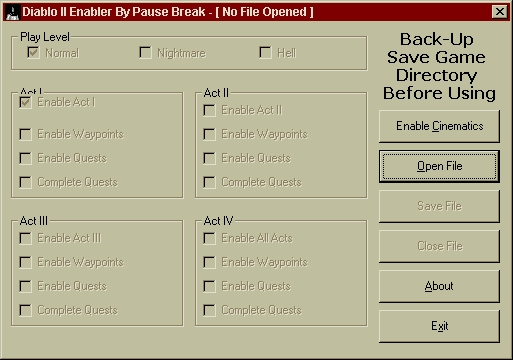



## Diablo II Enabler \- How to make a SGE or Trainer

### Description

Diablo II Enabler is program that edits the saved game files from Diablo II that allows users to enable all difficulties, acts, movies, waypoints, quests and more. The Visual Basic 6 source code is good learners tool for creating SGEs (Saved Game Editor) and trainers. The program works by locating decimal offsets and then writes a hex value at that location. Worth a look by any new trainer maker using Visual Basic!
 
### More Info
 

             |
---                |---
**Submitted On**   |2000-08-13 19:00:30
**By**             |[Pause Break](https://github.com/Planet-Source-Code/PSCIndex/blob/master/ByAuthor/pause-break.md)
**Level**          |Beginner
**User Rating**    |4.3 (13 globes from 3 users)
**Compatibility**  |VB 5\.0, VB 6\.0
**Category**       |[Complete Applications](https://github.com/Planet-Source-Code/PSCIndex/blob/master/ByCategory/complete-applications__1-27.md)
**World**          |[Visual Basic](https://github.com/Planet-Source-Code/PSCIndex/blob/master/ByWorld/visual-basic.md)
**Archive File**   |[CODE\_UPLOAD89628142000\.zip](https://github.com/Planet-Source-Code/pause-break-diablo-ii-enabler-how-to-make-a-sge-or-trainer__1-10689/archive/master.zip)

